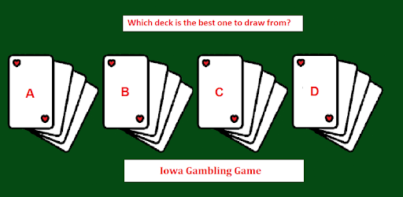

# Introduction to Iowa Gambling Task

The main idea behind the Iowa Gambling Task is test participants decision making using four cards. The participants taking part in the game have a choice of four cards (A,B,C,D) depending on the card choosen and chance the participants can gain or lose money.

:::{note}
The task was originally developed to detect problems that participants may have been having with their ventromedial prefrontal cortex
:::

